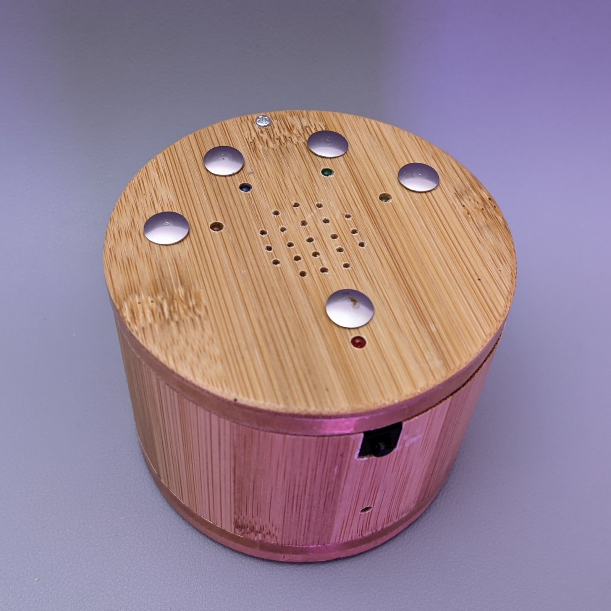
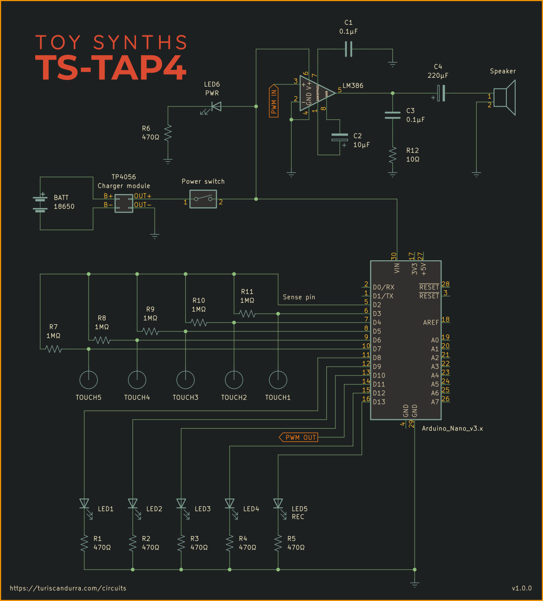

# TS-TAP4
## Arduino tap drum machine with looper

Arduino-based drum sequencer.
Just tap a rhythm on its touch sensors and it will start looping the sequence right away.

### Dependencies
[github.com/stevemarple/AsyncDelay](https://github.com/stevemarple/AsyncDelay)
[github.com/PaulStoffregen/CapacitiveSensor](https://github.com/PaulStoffregen/CapacitiveSensor)
PCM.h and PCM.c from [github.com/jelly/arduinoaudiobox](https://github.com/jelly/arduinoaudiobox)

### Adding your own samples
The sound samples are unsigned 8 bit 8000 Hz WAV files converted to header files using wav2c, a tool which can be compiled from the sources available at [github.com/jelly/arduinoaudiobox](https://github.com/jelly/arduinoaudiobox/tree/master/tools). Please note that after the conversion, you need to manually edit the header files and add the PROGMEM directive like in the samples provided.

### Schematic

Written for Arduino Nano or Arduino Uno.

Project info at [turiscandurra.com/circuits](https://turiscandurra.com/circuits)